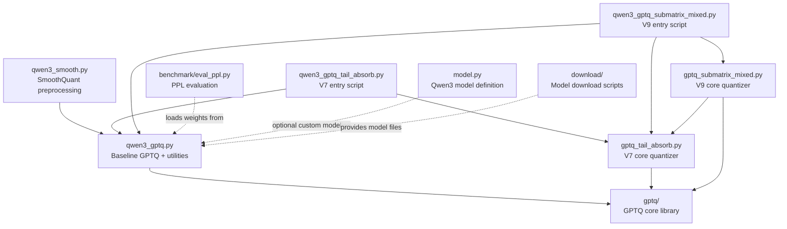

# AI Technical Reference — Submatrix Mixed Precision GPTQ

> **Purpose**: This document is designed for AI coding assistants to understand the implementation logic, code interfaces, and benchmark procedures, enabling accurate reproduction and extension to larger models.

---

## 1. Method Overview

This repository implements three weight quantization schemes for Qwen3 models, all based on GPTQ with FakeQuant (quantize → dequantize, storing float16 weights):

### 1.1 Baseline GPTQ (`gptq_4bit_raw` / `smooth_gptq_4bit`)

- Standard GPTQ 4-bit weight quantization with per-group (g128) scale.
- Optional SmoothQuant preprocessing (`qwen3_smooth.py`): migrates activation outliers into weights via per-channel scaling before GPTQ.
- `fp16_baseline`: No weight quantization, used as PPL reference.

### 1.2 V7 Tail Absorb (`smooth_ta_r{16,64,128}`)

- **Core idea**: After act-order sorting (by Hessian diagonal, descending), the last `tail_rank` columns (least important activations) use INT8 per-column symmetric FakeQuant instead of INT4.
- **Key difference from standard GPTQ**: Only the quantization precision changes for tail columns; GPTQ error propagation remains identical.
- **Parameters**: `--tail-rank` (absolute column count), `--percentile-k` (scale clipping percentile).
- **File**: `gptq_tail_absorb.py` → class `GPTQTailAbsorb`, method `fasterquant()`.

### 1.3 V9 Submatrix Mixed Precision (`v9_b{R}x{C}_r{B}_{metric}`)

- **Core idea**: Instead of fixed tail/head columns, divide the weight matrix into `(brow × bcol)` submatrix blocks. Use a sensitivity metric to select the top `budget_ratio`% blocks for INT8 quantization; the rest use INT4.
- **Two phases**:
  - **Phase 1** (`compute_block_sensitivity()`): Score each submatrix block. Metrics: `quant_error` (INT4 fake-quant Frobenius norm), `hessian_weighted` (Hessian-weighted quant error), `weight_norm` (block Frobenius norm).
  - **Phase 2** (column-wise GPTQ loop): For each column, check `high_precision_mask[block_row, block_col]` to decide INT4 vs INT8 per row-segment. Error propagation is identical to standard GPTQ.
- **Parameters**: `--block-rows`, `--block-cols`, `--budget-ratio`, `--sensitivity-metric`.
- **File**: `gptq_submatrix_mixed.py` → class `GPTQSubmatrixMixed`, method `fasterquant()`.

---

## 2. Code Architecture

### 2.1 File Dependency Graph



### 2.2 File Responsibilities

| File | Role | Lines |
|------|------|-------|
| `qwen3_gptq.py` | Baseline GPTQ entry + shared utilities (`get_qwen3`, `get_wikitext2_or_fallback_loader`, `dtype_from_str`, `load_custom_model_class`, `register_custom_model`) | ~498 |
| `qwen3_smooth.py` | SmoothQuant preprocessing (alpha=1.0, per-channel activation scaling) | ~268 |
| `qwen3_gptq_tail_absorb.py` | V7 Tail Absorb entry script (CLI → model load → `qwen3_sequential_tail_absorb()` → save) | ~450 |
| `gptq_tail_absorb.py` | V7 core: `GPTQTailAbsorb(GPTQ)`, `PercentileQuantizer(Quantizer)`, `_int8_fakequant_column()` | ~378 |
| `qwen3_gptq_submatrix_mixed.py` | V9 entry script (CLI → model load → `qwen3_sequential_submatrix_mixed()` → save) | ~580 |
| `gptq_submatrix_mixed.py` | V9 core: `GPTQSubmatrixMixed(GPTQ)`, `compute_block_sensitivity()`, vectorized helpers | ~525 |
| `infer_quantized_qwen3.py` | Interactive inference with quantized weights | — |
| `benchmark/eval_ppl.py` | WikiText-2 PPL evaluation with multi-format activation quantization | ~775 |
| `model.py` | Custom Qwen3 model definition (used with `--custom-modeling-file`) | — |
| `gptq/gptq.py` | Original GPTQ algorithm (base class `GPTQ`) | — |
| `gptq/quant.py` | Original quantizer (base class `Quantizer`, `quantize()` function) | — |

---

## 3. Core API Reference

### 3.1 Shared Utilities (`qwen3_gptq.py`)

```python
# Line ~88-100
def get_qwen3(model_dir: str, dtype: torch.dtype) -> AutoModelForCausalLM:
    """Load Qwen3 model with seqlen set to min(2048, max_position_embeddings)."""

# Line ~60-86
def get_wikitext2_or_fallback_loader(
    tokenizer, model_dir, nsamples, seqlen, seed, output_dir, local_wikitext2_dir=""
) -> tuple[list, dict]:
    """
    Returns: (trainloader, source_info)
    - trainloader: list of (input_ids, targets) tuples, each [1, seqlen]
    - source_info: dict with keys 'calib_source', 'fallback_used', 'reason', etc.
    """

# Line ~28-42
def load_custom_model_class(modeling_file: str) -> type:
    """Dynamically load a custom Qwen3ForCausalLM class from a .py file."""

# Line ~44-48
def register_custom_model(custom_model_cls) -> None:
    """Register custom model class with AutoModelForCausalLM."""

# Line ~50-52
def dtype_from_str(name: str) -> torch.dtype:
    """Convert 'float16'/'bfloat16'/'float32' to torch.dtype."""
```

### 3.2 V7 Core Quantizer (`gptq_tail_absorb.py`)

```python
# Line ~50-130: PercentileQuantizer
class PercentileQuantizer(Quantizer):
    """
    Uses k-th percentile (default 75) instead of min/max for quantization scale.
    Clips outliers to reduce scale inflation.

    Args:
        shape: Quantizer shape parameter (default 1)
        percentile_k: Percentile value 0-100 (default 75.0)

    Attributes after find_params():
        self.scale: Per-channel quantization scale
        self.zero: Per-channel zero point
        self.clip_ratio: Fraction of weights clipped by percentile
    """

# Line ~135-150: _int8_fakequant_column
def _int8_fakequant_column(w: torch.Tensor, eps: float = 1e-8) -> torch.Tensor:
    """
    INT8 symmetric FakeQuant for a single column vector.
    scale = max(|w|) / 127, q = clamp(round(w/scale), -128, 127), return q * scale.
    """

# Line ~155-378: GPTQTailAbsorb
class GPTQTailAbsorb(GPTQ):
    def fasterquant(
        self,
        blocksize=128, percdamp=0.01, groupsize=-1,
        actorder=False, static_groups=False,
        tail_rank=0, head_absorb=False,
    ) -> dict:
        """
        Returns stats dict with keys:
            'n_main_quantized', 'n_tail_int8', 'tail_rank', 'head_absorb',
            'main_start', 'main_end', 'gptq_loss', 'elapsed_seconds'
        """
```

### 3.3 V9 Core Quantizer (`gptq_submatrix_mixed.py`)

```python
# Line ~60-100: Vectorized helpers
def _vectorized_int4_fakequant_blocks(blocks, maxq, sym) -> tuple[Tensor, Tensor]:
    """Vectorized per-block INT4 FakeQuant. Returns (blocks_q, errors)."""

def _pad_and_reshape_to_blocks(W, brow, bcol, nrow, ncol) -> Tensor:
    """Zero-pad W and reshape to (nrow, ncol, brow, bcol) 4D block view."""

# Line ~105-200: Phase 1
def compute_block_sensitivity(
    W: Tensor, block_shape: tuple, budget_ratio: float,
    metric: str = "quant_error",
    quantizer=None, H_diag=None,
) -> tuple[Tensor, Tensor]:
    """
    Args:
        W: (d_out, d_in) weight tensor (after act-order permutation)
        block_shape: (brow, bcol)
        budget_ratio: 0.0-1.0, fraction of blocks to use INT8
        metric: 'quant_error' | 'weight_norm' | 'hessian_weighted'
        quantizer: Required for quant_error/hessian_weighted
        H_diag: Required for hessian_weighted, shape (d_in,)

    Returns:
        scores: (nrow, ncol) sensitivity scores
        high_precision_mask: (nrow, ncol) bool, True = INT8 block
    """

# Line ~210-525: GPTQSubmatrixMixed
class GPTQSubmatrixMixed(GPTQ):
    def fasterquant(
        self,
        blocksize=128, percdamp=0.01, groupsize=-1,
        actorder=False, static_groups=False,
        block_shape=(128, 128), budget_ratio=0.05,
        sensitivity_metric="quant_error",
    ) -> dict:
        """
        Returns stats dict with keys:
            'gptq_loss', 'elapsed_seconds',
            'n_int4_segments', 'n_int8_segments',
            'grid_shape', 'n_int8_blocks', 'n_total_blocks',
            'top5_sensitivity_scores', 'block_shape',
            'budget_ratio', 'sensitivity_metric'
        """
```

### 3.4 Benchmark (`benchmark/eval_ppl.py`)

```python
# Key CLI arguments:
#   --model-dir       : HuggingFace model directory (required)
#   --quant-weights   : Path to quantized .pt state_dict (optional, FP16 if omitted)
#   --label           : Run label for result identification
#   --act-quant       : 'none' | 'int8' | 'int4-g128'
#   --act-quant-override : 'down_proj:int8' (per-layer override)
#   --output-dir      : Results directory
#   --results-file    : Summary txt filename (default: 'results.txt')
#   --seqlen          : Sliding window size (default: 2048)
#   --local-wikitext2-dir : Local WikiText-2 dataset path

# Output:
#   1. JSON file: output_dir/ppl_{label}.json
#   2. Appended line in: output_dir/{results_file}
```

---

## 4. Quantization Pipelines

### 4.1 Pipeline: Baseline GPTQ (`fp16_baseline` / `gptq_4bit_raw`)

```
Original Model (FP16)
    │
    ├─ [fp16_baseline] → No quantization, direct PPL eval
    │
    └─ qwen3_gptq.py
         │  1. Load model
         │  2. Capture calibration data (WikiText-2, 32 samples × 1024 tokens)
         │  3. Layer-by-layer GPTQ:
         │     - Collect Hessian via add_batch()
         │     - fasterquant(): 4-bit per-group(g128) FakeQuant
         │     - Error propagation to next layer
         │  4. Save state_dict → .pt file
         └─ Output: gptq_from_raw/qwen3-4b-instruct-2507-gptq-4bit.pt
```

### 4.2 Pipeline: SmoothQuant + GPTQ (`smooth_gptq_4bit`)

```
Original Model (FP16)
    │
    └─ qwen3_smooth.py
         │  1. Load model
         │  2. Collect per-channel activation max via RMSNorm hooks
         │  3. Compute smooth scale: s = act_max (alpha=1.0)
         │  4. Apply: W_new = W * diag(s), save state_dict
         └─ Output: smooth/qwen3-4b-smooth-state_dict.pt
                │
                └─ qwen3_gptq.py --init-state-dict smooth/qwen3-4b-smooth-state_dict.pt
                     │  Same GPTQ pipeline as 4.1, but on smoothed weights
                     └─ Output: gptq_from_smooth/qwen3-4b-instruct-2507-gptq-4bit.pt
```

### 4.3 Pipeline: V7 Tail Absorb (`smooth_ta_r{16,64,128}`)

```
Smoothed Weights (.pt)
    │
    └─ qwen3_gptq_tail_absorb.py --init-state-dict <smooth.pt> --tail-rank 16
         │  1. Load model + smooth weights
         │  2. Capture calibration data
         │  3. Layer-by-layer GPTQTailAbsorb:
         │     a. Collect Hessian
         │     b. fasterquant(tail_rank=16, actorder=True):
         │        - Act-order sort columns by Hessian diagonal (descending)
         │        - Columns [0, d_in-16): 4-bit PercentileQuantizer FakeQuant
         │        - Columns [d_in-16, d_in): INT8 per-column FakeQuant
         │        - Both propagate error identically to standard GPTQ
         │        - invperm restores original column order
         │  4. Save state_dict
         └─ Output: exp_smooth_tail_absorb/from_smooth_r16/qwen3-4b-...-gptq-4bit.pt
```

### 4.4 Pipeline: V9 Submatrix Mixed Precision (`v9_b128x128_r5_qe`)

```
Smoothed Weights (.pt)
    │
    └─ qwen3_gptq_submatrix_mixed.py --init-state-dict <smooth.pt> \
           --block-rows 128 --block-cols 128 --budget-ratio 0.05 \
           --sensitivity-metric quant_error
         │  1. Load model + smooth weights
         │  2. Capture calibration data
         │  3. Layer-by-layer GPTQSubmatrixMixed:
         │     a. Collect Hessian
         │     b. fasterquant():
         │        Phase 1 — compute_block_sensitivity():
         │          - Pad W to grid-aligned shape
         │          - Vectorized per-block INT4 FakeQuant
         │          - Score = Frobenius norm of quant error per block
         │          - Select top ceil(5% × n_blocks) as INT8
         │          → high_precision_mask: (nrow, ncol) bool tensor
         │
         │        Phase 2 — Column-wise GPTQ loop:
         │          For each column col_idx:
         │            block_col = col_idx // bcol
         │            If all rows INT4 → fast path: single quantize() call
         │            If all rows INT8 → fast path: single _int8_fakequant_column()
         │            If mixed → INT4 first, then overlay INT8 on marked row-segments
         │            Error propagation: identical to standard GPTQ
         │
         │        invperm restores original column order
         │  4. Save state_dict + metadata.json
         └─ Output: exp_submatrix_mixed/qwen3-4b-...-gptq-4bit.pt
```

---

## 5. Benchmark Procedure

### 5.1 Running eval_ppl.py

All commands assume working directory is `qwen3_gptq_repro/`.

```bash
# FP16 baseline (no weight quant, no activation quant)
python benchmark/eval_ppl.py \
    --model-dir /path/to/Qwen3-4B-Instruct-2507 \
    --label fp16_baseline_Anone \
    --act-quant none \
    --local-wikitext2-dir /path/to/wikitext2

# GPTQ 4-bit raw with INT8 activation quant
python benchmark/eval_ppl.py \
    --model-dir /path/to/Qwen3-4B-Instruct-2507 \
    --quant-weights output/gptq_from_raw/qwen3-4b-instruct-2507-gptq-4bit.pt \
    --label gptq_4bit_raw_A8 \
    --act-quant int8

# V7 Tail Absorb r16 with INT4-g128 + down_proj:INT8
python benchmark/eval_ppl.py \
    --model-dir /path/to/Qwen3-4B-Instruct-2507 \
    --quant-weights output/exp_smooth_tail_absorb/from_smooth_r16/qwen3-4b-instruct-2507-gptq-4bit.pt \
    --label smooth_ta_r16_A4g128_downA8 \
    --act-quant int4-g128 \
    --act-quant-override down_proj:int8

# V9 Submatrix Mixed b128x128 r10 quant_error, no activation quant
python benchmark/eval_ppl.py \
    --model-dir /path/to/Qwen3-4B-Instruct-2507 \
    --quant-weights output/exp_submatrix_mixed/b128x128_r10_qe/qwen3-4b-instruct-2507-gptq-4bit.pt \
    --label v9_b128x128_r10_qe_Anone \
    --act-quant none \
    --output-dir output/benchmark_v9 \
    --results-file results_v9_all.txt
```

### 5.2 Output Format

Each run produces:
1. **JSON**: `output/benchmark/ppl_{label}.json` — full result with metadata
2. **TXT append**: `output/benchmark/results.txt` — one-line summary for cross-comparison

JSON schema:
```json
{
    "label": "smooth_ta_r16_Anone",
    "ppl": 10.3428,
    "total_tokens": 298862,
    "elapsed_seconds": 37.46,
    "model_dir": "/absolute/path/to/model",
    "quant_weights": "/absolute/path/to/weights.pt",
    "seqlen": 2048,
    "seed": 0,
    "dtype": "float16",
    "act_quant": "none",
    "data_source": "online: huggingface wikitext-2-raw-v1 test",
    "timestamp": "2026-04-10T16:10:21.783029"
}
```

### 5.3 Activation Quantization Modes

| `--act-quant` | Description | Label suffix |
|---|---|---|
| `none` | FP16 pass-through | `_Anone` |
| `int8` | Per-token INT8 symmetric | `_A8` |
| `int4-g128` | Per-group INT4 symmetric (g=128) | `_A4g128` |
| `int4-g128` + `--act-quant-override down_proj:int8` | INT4-g128 globally, INT8 for down_proj | `_A4g128_downA8` |

---

## 6. Extension Guide — Scaling to Larger Models

### 6.1 Model-Specific Parameters to Modify

| Parameter | Qwen3-4B | Qwen3-14B (est.) | Qwen3-72B (est.) |
|---|---|---|---|
| `--model-dir` | `Qwen3-4B-Instruct-2507` | `Qwen3-14B-Instruct` | `Qwen3-72B-Instruct` |
| `hidden_size` | 2560 | 5120 | 8192 |
| `num_layers` | 36 | 40 | 80 |
| `--seqlen` | 1024 | 1024 | 512-1024 |
| `--nsamples` | 32 | 32 | 16-32 |
| `--block-rows` (V9) | 128 | 128-256 | 256 |
| `--block-cols` (V9) | 128 | 128 | 128 |
| `--budget-ratio` (V9) | 0.05-0.10 | 0.05-0.10 | 0.05 |
| GPU VRAM needed | ~16GB | ~40GB | ~160GB (multi-GPU) |

### 6.2 Key Considerations

1. **Memory**: Larger models require more VRAM. The GPTQ algorithm processes one layer at a time, so peak VRAM ≈ 2× single layer size + Hessian matrix. For 72B, consider `--nsamples 16` and `--seqlen 512`.

2. **block_shape alignment**: `--block-cols` should equal `--groupsize` (default 128) for optimal quantization. `--block-rows` can be adjusted; larger values reduce Phase 1 overhead but give coarser granularity.

3. **Calibration data**: All scripts support `--local-wikitext2-dir` for offline environments. The fallback mechanism generates synthetic text if WikiText-2 is unavailable (not recommended for production).

4. **Output paths**: Update `--output-dir` to avoid overwriting Qwen3-4B results. Recommended structure:
   ```
   output/
   ├── exp_smooth_tail_absorb/
   │   ├── qwen3_4b_r16/
   │   └── qwen3_14b_r16/
   └── exp_submatrix_mixed/
       ├── qwen3_4b_b128x128_r10_qe/
       └── qwen3_14b_b128x128_r10_qe/
   ```

5. **SmoothQuant**: Must be re-run for each model size. The smooth state_dict is model-specific.

6. **Benchmark JSON paths**: JSON files record absolute server paths in `quant_weights` field. These paths are environment-specific and will differ on other machines. The `--quant-weights` argument at eval time should point to the actual local path.

### 6.3 Recommended First Experiment on a New Model

```bash
# Step 1: SmoothQuant preprocessing
python qwen3_smooth.py \
    --model-dir /path/to/Qwen3-14B-Instruct \
    --output-dir output/smooth_14b

# Step 2: V9 with best-known config (b128x128, r10, quant_error)
python qwen3_gptq_submatrix_mixed.py \
    --model-dir /path/to/Qwen3-14B-Instruct \
    --init-state-dict output/smooth_14b/qwen3-14b-smooth-state_dict.pt \
    --output-dir output/exp_submatrix_mixed/qwen3_14b_b128x128_r10_qe \
    --block-rows 128 --block-cols 128 \
    --budget-ratio 0.10 \
    --sensitivity-metric quant_error

# Step 3: Evaluate PPL
python benchmark/eval_ppl.py \
    --model-dir /path/to/Qwen3-14B-Instruct \
    --quant-weights output/exp_submatrix_mixed/qwen3_14b_b128x128_r10_qe/qwen3-14b-instruct-gptq-4bit.pt \
    --label v9_14b_b128x128_r10_qe_Anone \
    --act-quant none \
    --output-dir output/benchmark_14b
```

---

## 7. Reference PPL Results (Qwen3-4B-Instruct-2507)

| Method | ActQ=none | ActQ=int8 | ActQ=int4-g128 | ActQ=int4-g128+down:int8 |
|---|---|---|---|---|
| fp16_baseline | **10.0449** | 10.3204 | 14.1556 | 13.4046 |
| gptq_4bit_raw | 10.3845 | 10.7033 | 15.3095 | 14.3323 |
| smooth_gptq_4bit | 10.8361 | 11.1372 | 14.1750 | 13.4645 |
| smooth_ta_r16 (V7) | 10.3428 | 10.6156 | 13.2699 | 12.6241 |
| smooth_ta_r64 (V7) | 10.4042 | 10.6748 | 13.3250 | 12.6773 |
| smooth_ta_r128 (V7) | 10.4184 | 10.6897 | 13.3127 | 12.6651 |
| v9_b128x128_r5_qe | 10.4101 | 10.6780 | 13.2787 | 12.6604 |
| v9_b128x128_r10_qe | 10.2813 | 10.5519 | **13.0820** | 12.5364 |
| v9_b64x128_r5_qe | 10.4995 | 10.7740 | 13.4539 | 12.8182 |
| v9_b64x128_r10_qe | **10.2786** | **10.5419** | 13.1487 | **12.5297** |
| v9_b128x128_r5_hw | 10.3958 | 10.6543 | 13.2235 | 12.5604 |
| v9_b128x128_r5_wn | 10.4412 | 10.7223 | 13.2972 | 12.6696 |

**Best quantized PPL**: v9_b64x128_r10_qe, ActQ=none → **10.2786** (FP16 gap: +0.2337)
