# Qwen3 GPTQ 权重变体总览

> 本文档汇总了 `qwen3_gptq_repro` 项目中所有权重量化变体的架构、实现方式与功能定位。
> 目标模型：**Qwen3-4B-Instruct-2507**

---

## 变体总数：22 种

### V1-V3 变体（#1-#10）

| # | 变体名称 | 权重量化 | 激活量化 | 实现脚本 | PPL (W4A4) |
|---|---------|---------|---------|---------|-----------|
| 1 | FP16 Baseline | 无 (FP16) | INT4 | — | 10.0449 |
| 2 | GPTQ 4-bit (from raw) | INT4 (GPTQ) | INT4 | `qwen3_gptq.py` | 5593.58 |
| 3 | Smooth(α=1) + GPTQ 4-bit | INT4 (SmoothQuant + GPTQ) | INT4 | `qwen3_smooth.py` → `qwen3_gptq.py` | 5289.94 |
| 4 | Tail Mixed (5% INT8) | INT4 (GPTQ) + INT8 (tail 5%) | INT4 | `qwen3_gptq_tail_mixed.py` | 4911.50 |
| 5 | Percentile+Tail Mode A (k=75, r=16) | INT4 (percentile uniform) + INT8 (tail) | INT4 | `qwen3_gptq_percentile_tail.py` | NaN |
| 6 | Percentile+Tail Mode B (k=75, r=16) | INT4 (GPTQ main) + INT8 (tail) | INT4 | `qwen3_gptq_percentile_tail.py` | 5008.68 |
| 7 | Tail Spill Standard (r=16) | INT4 (标准 GPTQ + tail spill) + INT8 (tail) | INT4 | `qwen3_gptq_percentile_tail_spill.py` | 6482.01 |
| 8 | Percentile Tail Spill (raw, k=75, r=16) | INT4 (Percentile GPTQ + tail spill) + INT8 (tail) | INT4 | `qwen3_gptq_percentile_tail_spill.py` | 26944.23 |
| 9 | Percentile Tail Spill (smooth, k=75, r=16) | INT4 (Smooth + Percentile GPTQ + tail spill) + INT8 (tail) | INT4 | `qwen3_gptq_percentile_tail_spill.py` | 11763.78 |
| 10 | Percentile Tail Spill (smooth, k=90, r=16) | INT4 (Smooth + Percentile GPTQ + tail spill) + INT8 (tail) | INT4 | `qwen3_gptq_percentile_tail_spill.py` | 15610.00 |

> **注意**：变体 #1-#10 的 PPL 数值来自 W4A4 评测（权重 INT4 + 激活 INT4 per-token 对称量化模拟），数值较高是因为 A4 激活量化引入了额外误差。

### V5 变体（#11-#13）— Standard Tail Spill (from raw)

| # | 变体名称 | 权重量化 | 实现脚本 | PPL (Anone) |
|---|---------|---------|---------|-------------|
| 11 | Std Tail Spill (raw, r=16) | INT4 (标准 GPTQ) + INT8 (tail) | `qwen3_gptq_percentile_tail_spill.py` | — |
| 12 | Std Tail Spill (raw, r=64) | INT4 (标准 GPTQ) + INT8 (tail) | `qwen3_gptq_percentile_tail_spill.py` | — |
| 13 | Std Tail Spill (raw, r=128) | INT4 (标准 GPTQ) + INT8 (tail) | `qwen3_gptq_percentile_tail_spill.py` | — |

> **注意**：V5 实验未进行 PPL 评测，数据不可用。

### V6 变体（#14-#16）— Smooth + Standard Tail Spill

| # | 变体名称 | 权重量化 | 实现脚本 | PPL (Anone) |
|---|---------|---------|---------|-------------|
| 14 | Smooth + Std Tail Spill (r=16) | INT4 (Smooth + 标准 GPTQ) + INT8 (tail) | `qwen3_gptq_percentile_tail_spill.py` | 10.4404 |
| 15 | Smooth + Std Tail Spill (r=64) | INT4 (Smooth + 标准 GPTQ) + INT8 (tail) | `qwen3_gptq_percentile_tail_spill.py` | 10.6128 |
| 16 | Smooth + Std Tail Spill (r=128) | INT4 (Smooth + 标准 GPTQ) + INT8 (tail) | `qwen3_gptq_percentile_tail_spill.py` | 11.1749 |

> 数据来源：`output/benchmark/results_smooth_stdts.txt`

### V7 变体（#17-#22）— Smooth + Tail Absorb

**act-order ON（#17-#19）：**

| # | 变体名称 | 权重量化 | 实现脚本 | PPL (Anone) |
|---|---------|---------|---------|-------------|
| 17 | Smooth + Tail Absorb (r=16, act-order ON) | INT4 (Smooth + 标准 GPTQ) + INT8 (tail, 误差传播) | `qwen3_gptq_tail_absorb.py` | 10.3428 |
| 18 | Smooth + Tail Absorb (r=64, act-order ON) | INT4 (Smooth + 标准 GPTQ) + INT8 (tail, 误差传播) | `qwen3_gptq_tail_absorb.py` | 10.4042 |
| 19 | Smooth + Tail Absorb (r=128, act-order ON) | INT4 (Smooth + 标准 GPTQ) + INT8 (tail, 误差传播) | `qwen3_gptq_tail_absorb.py` | 10.4184 |

**act-order OFF（#20-#22）：**

| # | 变体名称 | 权重量化 | 实现脚本 | PPL (Anone) |
|---|---------|---------|---------|-------------|
| 20 | Smooth + Tail Absorb (r=16, act-order OFF) | INT4 (Smooth + 标准 GPTQ) + INT8 (tail, 误差传播) | `qwen3_gptq_tail_absorb.py` | 10.3846 |
| 21 | Smooth + Tail Absorb (r=64, act-order OFF) | INT4 (Smooth + 标准 GPTQ) + INT8 (tail, 误差传播) | `qwen3_gptq_tail_absorb.py` | 10.3909 |
| 22 | Smooth + Tail Absorb (r=128, act-order OFF) | INT4 (Smooth + 标准 GPTQ) + INT8 (tail, 误差传播) | `qwen3_gptq_tail_absorb.py` | 10.3949 |

> 数据来源：`output/benchmark/results_smooth_tail_absorb.txt`
>
> **PPL 列说明**：变体 #1-#10 的 PPL 来自 W4A4 评测（激活 INT4）；变体 #11-#22 的 PPL 来自 Anone 评测（无激活量化）。完整的多配置 PPL 数据见 `docs/analysis/ALL_WORK_SUMMARY.md` 第 12 节。

---

## 各变体详细说明

### 1. FP16 Baseline

- **脚本**：无需量化脚本，直接加载原始模型
- **架构**：原始 Qwen3-4B-Instruct-2507 FP16 权重，不做任何权重量化
- **功能**：作为所有量化方案的 PPL 上界参考基线
- **评测方式**：`benchmark/eval_ppl.py`（默认启用 A4 激活量化）

---

### 2. GPTQ 4-bit (from raw)

- **脚本**：[qwen3_gptq.py](/Users/yangjiahu/Desktop/workspace/HKUST/Zip/qwen3_gptq_repro/qwen3_gptq.py)
- **架构**：
  - 标准 GPTQ 逐层量化流程
  - 所有 Linear 层统一 **4-bit per-channel** 量化
  - 使用标准 `Quantizer`（min/max 确定量化范围）
  - 支持 `--act-order`（activation-order 启发式）和 `--true-sequential`（分组顺序量化）
  - 校准数据：WikiText-2 train set（128 samples, seqlen=2048）
- **功能**：最基础的 GPTQ 4-bit 量化基线，直接对原始 FP16 权重做 GPTQ
- **核心函数**：`qwen3_sequential()` — 逐层捕获校准输入 → 收集 Hessian → GPTQ `fasterquant` 量化
- **输出产物**：`qwen3-4b-instruct-2507-gptq-4bit.pt` + `qwen3_gptq_4bit_metadata.json`

---

### 3. Smooth(α=1) + GPTQ 4-bit

- **脚本**：[qwen3_smooth.py](/Users/yangjiahu/Desktop/workspace/HKUST/Zip/qwen3_gptq_repro/qwen3_smooth.py) → [qwen3_gptq.py](/Users/yangjiahu/Desktop/workspace/HKUST/Zip/qwen3_gptq_repro/qwen3_gptq.py)
- **架构**：两阶段流水线
  1. **SmoothQuant 预处理**（`qwen3_smooth.py`）：
     - 采集每层 RMSNorm 输出的 per-channel 绝对值最大值（activation max）
     - 计算 smooth scale = `clamp(act_absmax, min=eps)`
     - 将 scale 从 RMSNorm 权重"迁移"到下游 Linear 权重：`norm.weight /= scale`，`linear.weight *= scale`
     - 目标：平滑激活分布中的 outlier，使权重更适合低精度量化
  2. **GPTQ 量化**（`qwen3_gptq.py --init-state-dict`）：
     - 加载 smooth 后的 state_dict
     - 执行标准 GPTQ 4-bit 量化
- **功能**：通过 SmoothQuant 预处理改善权重分布后再做 GPTQ，理论上可降低量化误差
- **核心参数**：`alpha=1.0`（smooth 强度），`eps=1e-5`（数值下限）
- **输出产物**：
  - Smooth 阶段：`smoothed_model_state_dict.pt` + `smooth_scales.pt` + `smooth_metadata.json`
  - GPTQ 阶段：`qwen3-4b-instruct-2507-gptq-4bit.pt`

---

### 4. Tail Mixed (5% INT8)

- **脚本**：[qwen3_gptq_tail_mixed.py](/Users/yangjiahu/Desktop/workspace/HKUST/Zip/qwen3_gptq_repro/qwen3_gptq_tail_mixed.py)
- **架构**：
  - **先做标准 GPTQ 4-bit 量化**（与变体 2 相同）
  - **后处理**：对每个 Linear 层的最后 5% 列（tail columns）用 **INT8 per-row 对称量化** 替换 GPTQ 4-bit 结果
  - 即：main 列保持 GPTQ 4-bit，tail 列升级为 INT8
- **功能**：混合精度方案 — 用少量额外 bit（tail 列 INT8）换取更高精度，尤其保护权重矩阵尾部列的信息
- **核心函数**：`quantize_tail_int8_inplace()` — 对 tail 列做 per-row INT8 量化并原地替换
- **关键参数**：
  - `--enable-tail-mixed`：启用混合精度
  - `--tail-ratio 0.05`：tail 列占比 5%
  - `--tail-quant int8`：tail 列量化精度
- **输出产物**：`qwen3-4b-instruct-2507-gptq-4bit.pt` + `qwen3_gptq_4bit_metadata.json`（含 `tail_mixed` 记录）

---

### 5. Percentile+Tail Mode A (k=75, r=16)

- **脚本**：[qwen3_gptq_percentile_tail.py](/Users/yangjiahu/Desktop/workspace/HKUST/Zip/qwen3_gptq_repro/qwen3_gptq_percentile_tail.py)
- **架构**：
  - 将权重矩阵按列分为 `W = [W_main, W_tail]`（tail_rank=16 列）
  - **Main 列**：使用 **percentile scale**（第 75 百分位数确定量化范围）做 uniform INT4 量化
  - **约束吸收**（Constrained Absorb）：在 INT4 边界内尽量吸收量化残差
  - **溢出投影**（Spill Projection）：将 main 列无法吸收的残差通过最小二乘投影到 tail 列
  - **Tail 列**：用 **INT8 per-row 对称量化**
  - 使用校准数据的激活统计（`x_summary`）来指导溢出投影
- **功能**：自研的分层残差吸收原型 — 用 percentile 截断 outlier + tail 列高精度缓冲吸收溢出误差
- **核心函数**：
  - `compute_percentile_scale()` — percentile 确定量化 scale
  - `apply_main_constrained_absorb()` — 约束吸收
  - `compute_tail_projection()` — 最小二乘溢出投影
  - `quantize_tail_high_precision()` — tail INT8 量化
- **关键参数**：`--percentile-k 75`，`--tail-rank 16`，`--lambda-reg 1e-4`，`--enable-main-absorb`
- **状态**：PPL 为 NaN，说明该模式存在数值稳定性问题

---

### 6. Percentile+Tail Mode B (k=75, r=16)

- **脚本**：[qwen3_gptq_percentile_tail.py](/Users/yangjiahu/Desktop/workspace/HKUST/Zip/qwen3_gptq_repro/qwen3_gptq_percentile_tail.py)（同变体 5，通过 `--use-gptq-main` 切换模式）
- **架构**：
  - 与 Mode A 相同的列分块：`W = [W_main, W_tail]`
  - **Main 列**：先走 **标准 GPTQ 4-bit 量化**（而非 percentile uniform），获得 `q0` 量化结果
  - **约束吸收**：在 GPTQ 量化结果的 row-max 边界内吸收残差
  - **溢出投影**：同 Mode A，将溢出残差投影到 tail 列
  - **Tail 列**：INT8 per-row 对称量化
- **功能**：Mode B 结合了 GPTQ 的 Hessian 感知量化优势与 tail 列高精度缓冲，理论上比 Mode A 更稳定
- **与 Mode A 的区别**：main 列使用 GPTQ（Hessian 感知）而非 percentile uniform 量化
- **关键参数**：`--use-gptq-main`（启用 GPTQ main），其余同 Mode A

---

### 7. Tail Spill Standard (r=16)

- **脚本**：[qwen3_gptq_percentile_tail_spill.py](/Users/yangjiahu/Desktop/workspace/HKUST/Zip/qwen3_gptq_repro/qwen3_gptq_percentile_tail_spill.py) + [gptq_tail_spill.py](/Users/yangjiahu/Desktop/workspace/HKUST/Zip/qwen3_gptq_repro/gptq_tail_spill.py)
- **架构**：
  - 使用修改版 GPTQ 核心类 `GPTQTailSpill`
  - 在 GPTQ 的 `fasterquant` 逐列迭代中：
    - **Main 列**（col < tail_start）：正常 4-bit 量化 + Hessian 误差补偿传播
    - **Tail 列**（col >= tail_start）：**跳过量化**，保留浮点值，但 Hessian 误差补偿仍正常传播
  - 这样 main 列的量化误差会自然"溢出"到 tail 列（通过 GPTQ 的误差补偿机制）
  - 最后对 tail 列做 **INT8 per-row 对称量化**
  - 使用 **标准 min/max Quantizer**（`--use-standard-quantizer`）
- **功能**：对比实验 — 验证 Tail Spill 机制本身的效果（不使用 percentile scale）
- **核心类**：`GPTQTailSpill`（继承 `GPTQ`，重写 `fasterquant`）
- **关键参数**：`--tail-rank 16`，`--use-standard-quantizer`

---

### 8. Percentile Tail Spill (raw, k=75, r=16)

- **脚本**：[qwen3_gptq_percentile_tail_spill.py](/Users/yangjiahu/Desktop/workspace/HKUST/Zip/qwen3_gptq_repro/qwen3_gptq_percentile_tail_spill.py) + [gptq_tail_spill.py](/Users/yangjiahu/Desktop/workspace/HKUST/Zip/qwen3_gptq_repro/gptq_tail_spill.py)
- **架构**：
  - 与变体 7 相同的 Tail Spill 机制（`GPTQTailSpill`）
  - 但使用 **PercentileQuantizer**（第 75 百分位数确定量化 scale）替代标准 min/max Quantizer
  - 从 **原始 FP16 权重** 出发
  - Main 列：Percentile GPTQ 4-bit + 误差溢出到 tail
  - Tail 列：INT8 per-row 对称量化
- **功能**：改进版 Mode A — 在 GPTQ 逐列迭代中自然溢出误差（而非后处理投影），配合 percentile scale 截断 outlier
- **核心类**：`PercentileQuantizer`（继承 `Quantizer`，重写 `find_params`，用 percentile 替代 min/max）
- **关键参数**：`--percentile-k 75`，`--tail-rank 16`

---

### 9. Percentile Tail Spill (smooth, k=75, r=16)

- **脚本**：[qwen3_gptq_percentile_tail_spill.py](/Users/yangjiahu/Desktop/workspace/HKUST/Zip/qwen3_gptq_repro/qwen3_gptq_percentile_tail_spill.py) + [gptq_tail_spill.py](/Users/yangjiahu/Desktop/workspace/HKUST/Zip/qwen3_gptq_repro/gptq_tail_spill.py)
- **架构**：
  - 与变体 8 完全相同的量化流程
  - 但从 **SmoothQuant 预处理后的权重** 出发（`--init-state-dict smooth/smoothed_model_state_dict.pt`）
  - 即：Smooth → Percentile GPTQ Tail Spill → INT8 tail
- **功能**：验证 SmoothQuant + Percentile Tail Spill 的组合效果
- **关键参数**：`--init-state-dict`（加载 smooth 权重），`--percentile-k 75`，`--tail-rank 16`

---

### 10. Percentile Tail Spill (smooth, k=90, r=16)

- **脚本**：同变体 9
- **架构**：
  - 与变体 9 完全相同，唯一区别是 **percentile_k=90**（更温和的截断，保留更多权重范围）
  - Smooth → Percentile(k=90) GPTQ Tail Spill → INT8 tail
- **功能**：超参数探索 — 对比 k=75 vs k=90 对 PPL 的影响
- **关键参数**：`--percentile-k 90`（vs 变体 9 的 75）

---

### 11. Std Tail Spill (raw, r=16)

- **脚本**：[qwen3_gptq_percentile_tail_spill.py](/Users/yangjiahu/Desktop/workspace/HKUST/Zip/qwen3_gptq_repro/qwen3_gptq_percentile_tail_spill.py) + [gptq_tail_spill.py](/Users/yangjiahu/Desktop/workspace/HKUST/Zip/qwen3_gptq_repro/gptq_tail_spill.py)
- **架构**：
  - 使用 `GPTQTailSpill` 核心类
  - 从 **原始 FP16 权重** 出发
  - Main 列：**标准 min/max Quantizer** + GPTQ 4-bit 量化 + Hessian 误差补偿
  - Tail 列（最后 16 列）：跳过量化，保留浮点值，**误差不传播**
  - 最后对 tail 列做 INT8 per-row 对称量化
- **功能**：V5 对照实验基线 — 使用标准 Quantizer（非 Percentile）+ Tail Spill，从原始权重出发
- **核心参数**：`--tail-rank 16`，`--use-standard-quantizer`
- **输出产物**：`output/exp_standard_tail_spill/from_raw_r16/qwen3-4b-instruct-2507-gptq-4bit.pt`
- **PPL**：未评测

---

### 12. Std Tail Spill (raw, r=64)

- **脚本**：同变体 11
- **架构**：与变体 11 完全相同，唯一区别是 **tail_rank=64**（更多列划入 tail 区域）
- **功能**：V5 rank 消融实验 — 对比 r=16 vs r=64 的效果
- **核心参数**：`--tail-rank 64`，`--use-standard-quantizer`
- **输出产物**：`output/exp_standard_tail_spill/from_raw_r64/qwen3-4b-instruct-2507-gptq-4bit.pt`
- **PPL**：未评测

---

### 13. Std Tail Spill (raw, r=128)

- **脚本**：同变体 11
- **架构**：与变体 11 完全相同，唯一区别是 **tail_rank=128**
- **功能**：V5 rank 消融实验 — 对比 r=16 vs r=128 的效果
- **核心参数**：`--tail-rank 128`，`--use-standard-quantizer`
- **输出产物**：`output/exp_standard_tail_spill/from_raw_r128/qwen3-4b-instruct-2507-gptq-4bit.pt`
- **PPL**：未评测

---

### 14. Smooth + Std Tail Spill (r=16)

- **脚本**：[qwen3_smooth.py](/Users/yangjiahu/Desktop/workspace/HKUST/Zip/qwen3_gptq_repro/qwen3_smooth.py) → [qwen3_gptq_percentile_tail_spill.py](/Users/yangjiahu/Desktop/workspace/HKUST/Zip/qwen3_gptq_repro/qwen3_gptq_percentile_tail_spill.py) + [gptq_tail_spill.py](/Users/yangjiahu/Desktop/workspace/HKUST/Zip/qwen3_gptq_repro/gptq_tail_spill.py)
- **架构**：两阶段流水线
  1. **SmoothQuant 预处理**（`qwen3_smooth.py`）：alpha=1 平滑激活 outlier
  2. **标准 Tail Spill 量化**（`qwen3_gptq_percentile_tail_spill.py --use-standard-quantizer --init-state-dict`）：
     - 加载 smooth 后的 state_dict
     - Main 列：标准 GPTQ 4-bit + Hessian 误差补偿
     - Tail 列（最后 16 列）：跳过量化 → INT8 per-row 对称量化
- **功能**：V6 实验 — 验证 SmoothQuant + 标准 Tail Spill 的组合效果
- **核心参数**：`--tail-rank 16`，`--use-standard-quantizer`，`--init-state-dict`
- **输出产物**：`output/exp_standard_tail_spill/from_smooth_r16/qwen3-4b-instruct-2507-gptq-4bit.pt`
- **PPL (Anone)**：10.4404 | **PPL (A8)**：10.7206 | **PPL (A4g128)**：13.3974 | **PPL (A4g128+down:int8)**：12.7426
- **实验结果文件**：`output/benchmark/results_smooth_stdts.txt`

---

### 15. Smooth + Std Tail Spill (r=64)

- **脚本**：同变体 14
- **架构**：与变体 14 完全相同，唯一区别是 **tail_rank=64**
- **功能**：V6 rank 消融实验 — 对比 r=16 vs r=64
- **核心参数**：`--tail-rank 64`，`--use-standard-quantizer`，`--init-state-dict`
- **输出产物**：`output/exp_standard_tail_spill/from_smooth_r64/qwen3-4b-instruct-2507-gptq-4bit.pt`
- **PPL (Anone)**：10.6128 | **PPL (A8)**：10.9005 | **PPL (A4g128)**：13.5311 | **PPL (A4g128+down:int8)**：12.8757
- **⚠️ 发现 rank-PPL 反转**：r=64 的 PPL (10.61) 比 r=16 (10.44) 更差

---

### 16. Smooth + Std Tail Spill (r=128)

- **脚本**：同变体 14
- **架构**：与变体 14 完全相同，唯一区别是 **tail_rank=128**
- **功能**：V6 rank 消融实验 — 对比 r=16 vs r=128
- **核心参数**：`--tail-rank 128`，`--use-standard-quantizer`，`--init-state-dict`
- **输出产物**：`output/exp_standard_tail_spill/from_smooth_r128/qwen3-4b-instruct-2507-gptq-4bit.pt`
- **PPL (Anone)**：11.1749 | **PPL (A8)**：11.5178 | **PPL (A4g128)**：14.7505 | **PPL (A4g128+down:int8)**：14.0515
- **⚠️ rank-PPL 反转严重**：r=128 的 PPL (11.17) 远差于 r=16 (10.44)，根因为 `GPTQTailSpill` 的 tail 列不传播误差

---

### 17. Smooth + Tail Absorb (r=16, act-order ON)

- **脚本**：[qwen3_smooth.py](/Users/yangjiahu/Desktop/workspace/HKUST/Zip/qwen3_gptq_repro/qwen3_smooth.py) → [qwen3_gptq_tail_absorb.py](/Users/yangjiahu/Desktop/workspace/HKUST/Zip/qwen3_gptq_repro/qwen3_gptq_tail_absorb.py) + [gptq_tail_absorb.py](/Users/yangjiahu/Desktop/workspace/HKUST/Zip/qwen3_gptq_repro/gptq_tail_absorb.py)
- **架构**：两阶段流水线
  1. **SmoothQuant 预处理**（`qwen3_smooth.py`）：alpha=1 平滑激活 outlier
  2. **Tail Absorb 量化**（`qwen3_gptq_tail_absorb.py --use-standard-quantizer --init-state-dict --act-order`）：
     - 加载 smooth 后的 state_dict
     - 使用 `GPTQTailAbsorb` 核心类
     - Main 列：标准 GPTQ 4-bit + Hessian 误差补偿
     - Tail 列（最后 16 列）：**INT8 fake-quant + 误差正常传播**
     - 启用 act-order（activation-order 启发式列排序）
- **功能**：V7 修复版 — 使用 Tail Absorb 替代 Tail Spill，修复误差传播问题
- **核心参数**：`--tail-rank 16`，`--use-standard-quantizer`，`--init-state-dict`，`--act-order`
- **输出产物**：`output/exp_smooth_tail_absorb/from_smooth_r16/qwen3-4b-instruct-2507-gptq-4bit.pt`
- **PPL (Anone)**：10.3428 ⭐ | **PPL (A8)**：10.6156 | **PPL (A4g128)**：13.2699 | **PPL (A4g128+down:int8)**：12.6241
- **实验结果文件**：`output/benchmark/results_smooth_tail_absorb.txt`

---

### 18. Smooth + Tail Absorb (r=64, act-order ON)

- **脚本**：同变体 17
- **架构**：与变体 17 完全相同，唯一区别是 **tail_rank=64**
- **功能**：V7 rank 消融实验 — 对比 r=16 vs r=64（act-order ON）
- **核心参数**：`--tail-rank 64`，`--use-standard-quantizer`，`--init-state-dict`，`--act-order`
- **输出产物**：`output/exp_smooth_tail_absorb/from_smooth_r64/qwen3-4b-instruct-2507-gptq-4bit.pt`
- **PPL (Anone)**：10.4042 | **PPL (A8)**：10.6748 | **PPL (A4g128)**：13.3250 | **PPL (A4g128+down:int8)**：12.6773

---

### 19. Smooth + Tail Absorb (r=128, act-order ON)

- **脚本**：同变体 17
- **架构**：与变体 17 完全相同，唯一区别是 **tail_rank=128**
- **功能**：V7 rank 消融实验 — 对比 r=16 vs r=128（act-order ON）
- **核心参数**：`--tail-rank 128`，`--use-standard-quantizer`，`--init-state-dict`，`--act-order`
- **输出产物**：`output/exp_smooth_tail_absorb/from_smooth_r128/qwen3-4b-instruct-2507-gptq-4bit.pt`
- **PPL (Anone)**：10.4184 | **PPL (A8)**：10.6897 | **PPL (A4g128)**：13.3127 | **PPL (A4g128+down:int8)**：12.6651

---

### 20. Smooth + Tail Absorb (r=16, act-order OFF)

- **脚本**：同变体 17（但使用 `--no-act-order`）
- **架构**：与变体 17 完全相同，唯一区别是 **关闭 act-order**（不做 activation-order 列排序）
- **功能**：V7 act-order 消融实验 — 对比 act-order ON vs OFF（r=16）
- **核心参数**：`--tail-rank 16`，`--use-standard-quantizer`，`--init-state-dict`，`--no-act-order`
- **输出产物**：`output/exp_smooth_tail_absorb/from_smooth_r16_noact/qwen3-4b-instruct-2507-gptq-4bit.pt`
- **PPL (Anone)**：10.3846 | **PPL (A8)**：10.6643 | **PPL (A4g128)**：13.1251 | **PPL (A4g128+down:int8)**：12.5639

---

### 21. Smooth + Tail Absorb (r=64, act-order OFF)

- **脚本**：同变体 17（但使用 `--no-act-order`）
- **架构**：与变体 20 完全相同，唯一区别是 **tail_rank=64**
- **功能**：V7 act-order 消融实验 — 对比 act-order ON vs OFF（r=64）
- **核心参数**：`--tail-rank 64`，`--use-standard-quantizer`，`--init-state-dict`，`--no-act-order`
- **输出产物**：`output/exp_smooth_tail_absorb/from_smooth_r64_noact/qwen3-4b-instruct-2507-gptq-4bit.pt`
- **PPL (Anone)**：10.3909 | **PPL (A8)**：10.6664 | **PPL (A4g128)**：13.1782 | **PPL (A4g128+down:int8)**：12.6008

---

### 22. Smooth + Tail Absorb (r=128, act-order OFF)

- **脚本**：同变体 17（但使用 `--no-act-order`）
- **架构**：与变体 20 完全相同，唯一区别是 **tail_rank=128**
- **功能**：V7 act-order 消融实验 — 对比 act-order ON vs OFF（r=128）
- **核心参数**：`--tail-rank 128`，`--use-standard-quantizer`，`--init-state-dict`，`--no-act-order`
- **输出产物**：`output/exp_smooth_tail_absorb/from_smooth_r128_noact/qwen3-4b-instruct-2507-gptq-4bit.pt`
- **PPL (Anone)**：10.3949 | **PPL (A8)**：10.6680 | **PPL (A4g128)**：13.2016 | **PPL (A4g128+down:int8)**：12.6254

---

## 架构关系图

```mermaid
graph TD
    FP16[FP16 原始权重] --> GPTQ[变体2: GPTQ 4-bit]
    FP16 --> SMOOTH[SmoothQuant α=1]
    SMOOTH --> SMOOTH_GPTQ[变体3: Smooth + GPTQ 4-bit]
    FP16 --> TAIL_MIXED[变体4: Tail Mixed 5% INT8]
    FP16 --> MODE_A[变体5: Mode A Percentile+Tail]
    FP16 --> MODE_B[变体6: Mode B GPTQ+Tail]
    FP16 --> SPILL_STD[变体7: Tail Spill Standard]
    FP16 --> SPILL_RAW[变体8: Percentile Tail Spill raw]
    SMOOTH --> SPILL_SMOOTH75[变体9: Percentile Tail Spill smooth k=75]
    SMOOTH --> SPILL_SMOOTH90[变体10: Percentile Tail Spill smooth k=90]
    FP16 --> STDTS_RAW16[变体11-13: Std Tail Spill raw r=16/64/128]
    SMOOTH --> STDTS_SMOOTH[变体14-16: Smooth + Std Tail Spill r=16/64/128]
    SMOOTH --> TA_ACT_ON[变体17-19: Smooth + Tail Absorb act-ON r=16/64/128]
    SMOOTH --> TA_ACT_OFF[变体20-22: Smooth + Tail Absorb act-OFF r=16/64/128]

    style FP16 fill:#e1f5fe
    style SMOOTH fill:#fff3e0
    style GPTQ fill:#e8f5e9
    style SMOOTH_GPTQ fill:#e8f5e9
    style TAIL_MIXED fill:#fce4ec
    style MODE_A fill:#f3e5f5
    style MODE_B fill:#f3e5f5
    style SPILL_STD fill:#ede7f6
    style SPILL_RAW fill:#ede7f6
    style SPILL_SMOOTH75 fill:#ede7f6
    style SPILL_SMOOTH90 fill:#ede7f6
    style STDTS_RAW16 fill:#e0f2f1
    style STDTS_SMOOTH fill:#e0f2f1
    style TA_ACT_ON fill:#fff9c4
    style TA_ACT_OFF fill:#fff9c4
```

---

## 技术方法分类

### 第一类：标准 GPTQ 系列

| 变体 | 预处理 | 量化方法 | 后处理 |
|------|--------|---------|--------|
| 变体 2 | 无 | 标准 GPTQ 4-bit | 无 |
| 变体 3 | SmoothQuant | 标准 GPTQ 4-bit | 无 |

### 第二类：GPTQ + Tail 后处理

| 变体 | 预处理 | Main 列量化 | Tail 列处理 |
|------|--------|------------|------------|
| 变体 4 | 无 | 标准 GPTQ 4-bit | 后处理替换为 INT8 |

### 第三类：Percentile + Tail 分层残差吸收

| 变体 | 预处理 | Main 列量化 | 残差传递方式 | Tail 列处理 |
|------|--------|------------|-------------|------------|
| 变体 5 (Mode A) | 无 | Percentile uniform INT4 | 约束吸收 + 最小二乘投影 | INT8 |
| 变体 6 (Mode B) | 无 | GPTQ 4-bit | 约束吸收 + 最小二乘投影 | INT8 |

### 第四类：GPTQ Tail Spill（误差不传播版）

| 变体 | 预处理 | Quantizer | 误差溢出机制 | Tail 列处理 |
|------|--------|-----------|-------------|------------|
| 变体 7 | 无 | 标准 min/max | GPTQ 逐列误差补偿自然溢出 | INT8 |
| 变体 8 | 无 | Percentile k=75 | GPTQ 逐列误差补偿自然溢出 | INT8 |
| 变体 9 | SmoothQuant | Percentile k=75 | GPTQ 逐列误差补偿自然溢出 | INT8 |
| 变体 10 | SmoothQuant | Percentile k=90 | GPTQ 逐列误差补偿自然溢出 | INT8 |
| 变体 11-13 | 无 | 标准 min/max | GPTQ 逐列误差补偿自然溢出 | INT8 |
| 变体 14-16 | SmoothQuant | 标准 min/max | GPTQ 逐列误差补偿自然溢出 | INT8 |

> **特点**：Tail 列跳过量化，保留浮点值，误差不传播。V6 实验发现 rank 越大 PPL 越差（反转 bug）。

### 第五类：GPTQ Tail Absorb（误差正常传播版）

| 变体 | 预处理 | Quantizer | Tail 列处理 | act-order |
|------|--------|-----------|------------|----------|
| 变体 17 | SmoothQuant | 标准 min/max | INT8 fake-quant + 误差传播 | ON |
| 变体 18 | SmoothQuant | 标准 min/max | INT8 fake-quant + 误差传播 | ON |
| 变体 19 | SmoothQuant | 标准 min/max | INT8 fake-quant + 误差传播 | ON |
| 变体 20 | SmoothQuant | 标准 min/max | INT8 fake-quant + 误差传播 | OFF |
| 变体 21 | SmoothQuant | 标准 min/max | INT8 fake-quant + 误差传播 | OFF |
| 变体 22 | SmoothQuant | 标准 min/max | INT8 fake-quant + 误差传播 | OFF |

> **特点**：Tail 列做 INT8 fake-quant（量化后立即反量化），量化误差通过 Hessian 补偿正常传播。修复了第四类的 rank-PPL 反转问题。
> 与第四类（Tail Spill）的核心区别：Tail Absorb 的 tail 列会产生量化误差并传播，而 Tail Spill 的 tail 列不产生误差。

---

## 关键组件说明

| 组件 | 文件 | 功能 |
|------|------|------|
| `GPTQ` | `gptq/gptq.py`（外部库） | 标准 GPTQ 量化核心，基于 Hessian 逆的逐列量化 |
| `Quantizer` | `gptq/quant.py`（外部库） | 标准 min/max 量化器，确定量化 scale 和 zero point |
| `GPTQTailSpill` | `gptq_tail_spill.py` | 修改版 GPTQ，支持 tail 列跳过量化（误差自然溢出，不传播） |
| `GPTQTailAbsorb` | `gptq_tail_absorb.py` | 修改版 GPTQ，支持 tail 列 INT8 fake-quant（误差正常传播） |
| `PercentileQuantizer` | `gptq_tail_spill.py` | 用 percentile 替代 min/max 确定量化范围，截断 outlier |
| `quantize_tail_int8` | `gptq_tail_spill.py` | 对 tail 列做 per-row INT8 对称量化 |
| `eval_ppl.py` | `benchmark/eval_ppl.py` | WikiText-2 PPL 评测，支持 W4A4 激活量化模拟 |
